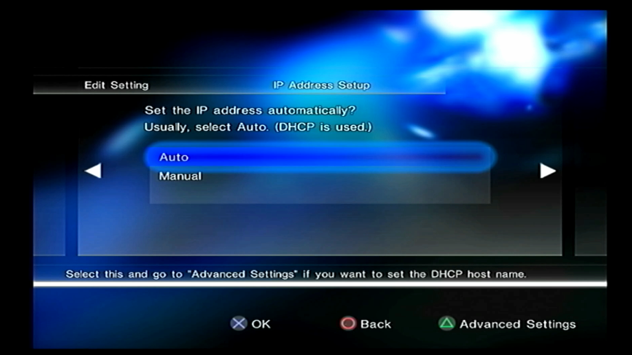
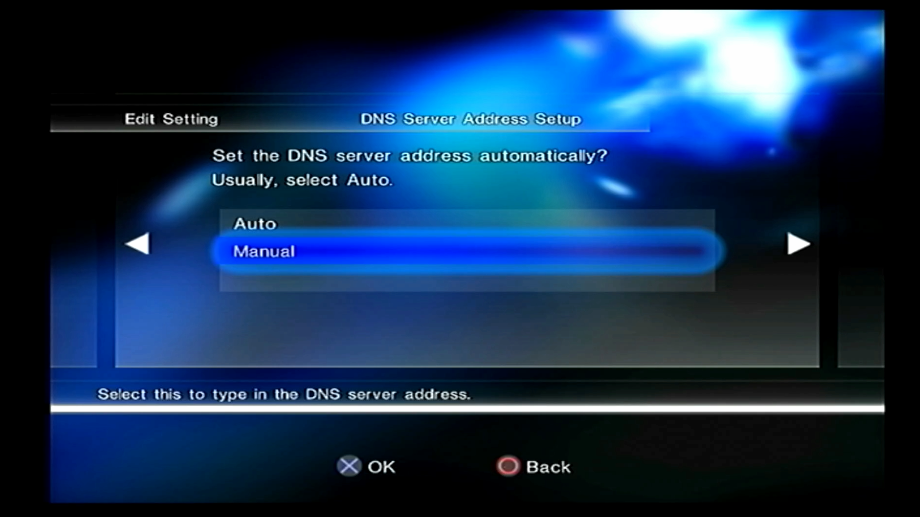
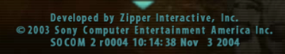
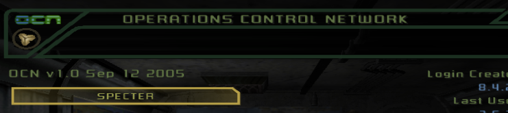

# Memdusa Exploit
Memdusa is an exploit for the PS2 that takes advantage of a packet in certain Medius based online games.

## How this works
> When a supported game connects to the memdusa server and sends up a specific packet request, Memdusa will then send down a specific payload that contains the elf and load code to the game. Some games will then auto load the elf while others require additional steps.

## Video
[](https://www.youtube.com/watch?v=LdkU-zksBig)


## Methods of use
[Connecting to our server (Easiest)](#connecting-to-our-remote-server)  
[Hosting locally](#Running-your-own-instance-locally)

## Connecting to our remote server
Things you will need:
- USB Flash drive formatted as **FAT32**
- Any homebrew you wish to load renamed to **BOOT.ELF**. I suggest [wLaunchELF](https://github.com/ps2homebrew/wLaunchELF/releases) (It's listed as Latest development build)
- A game that has the ability to create / edit a network config. [Check below](#Supported-Games)

The **BOOT.ELF** needs to be at the root of your flash drive. **Ex: F:\BOOT.ELF**

Startup a game that supports the network config editor and create a network config. Leave everything as default till you get to the DNS settings  


**Make sure to select manual for DNS**


Enter **157.173.205.4** as the **Primary DNS IP**. You can then continue to leave everything as default and then save the network setting. You don't need to test it.


Once the network setting is done then you can go online with any of the supported games using our DNS / your DNS if you are hosting locally. **Make sure your USB Drive is plugged into the PS2 before connecting!**


# Running your own instance locally
**This part is a work in progress as stuff has changed since the initial release**

## Requirements

- [.Net 10](https://dotnet.microsoft.com/en-us/download/dotnet/thank-you/runtime-desktop-10.0.5-windows-x64-installer)
- DNS Server or DNS proxy ([Retro DNS](https://github.com/PSRewired/RetroDNS))

## Usage
Start the server and have your PS2's DNS address pointed to your DNS server / proxy.
Select a game that is supported and connect online. ulaunch should load.
This is a heavily cut down version of it and only has USB support. Make sure whatever homebrew you want to load after is on a USB drive and plugged into the PS2.

## Using Retro DNS as a proxy
If you plan on using Retro DNS as your proxy you will need to edit the 99-domains.txt file to include the following:
```
killzone-prod.muis.pdonline.scea.com=ip://replaceme
socom2-prod.pdonline.scea.com=ip://replaceme
socom2-prod.muis.pdonline.scea.com=ip://replaceme
socom3-prod.muis.pdonline.scea.com=ip://replaceme
syphonfilter-prod.pdonline.scea.com=ip://replaceme
sfos-palmaster.online.scee.com=ip://replaceme
socomca.ps2.online.scea.com=ip://replaceme

// Catch all, unless you are running a DNAS repo you'll need this so it gets to ours
*=dns://67.222.156.250
```
Make sure you replace the "replaceme" text with the IP address that retro DNS shows you. Once you edit and save you can run retro DNS and click Start.

On your PS2 you will need to edit your network configurations. Killzone does not have this functionality so you will need another game that does. You will need to set your DNS 1 IP to the one that you got from retro DNS.


## Supported Games

| Game | GameID | AppID | Domain | Local Payload | Remote Payload | Network Setup |
|---|---|---|---|---|---|---|
| [ATV Offroad Fury 3](#atv-offroad-fury-3) | SCUS_974.05 | 10334 | atv3-prod.muis.pdonline.scea.com | ❌ | ✅ | ✅ |
| [Killzone](#killzone) | SCUS_974.02 | 10724 | killzone-prod.muis.pdonline.scea.com | ✅ | ✅ | ❌ |
| [Killzone](#killzone) | SCES_520.04 | 10444 | killzone-master.online.scee.com | ❌ | ✅ | ❌ |
| [Ratchet & Clank: Deadlocked](#ratchet-and-clank-deadlocked-and-up-your-arsenal) | SCUS_974.65 | 11184 | ratchetdl-prod.pdonline.scea.com | ❌ | ✅ | ✅ |
| [Ratchet & Clank: Up Your Arsenal](#ratchet-and-clank-deadlocked-and-up-your-arsenal) | SCUS_973.53 | 10684 | ratchet3-prod1.pdonline.scea.com | ❌ | ✅ | ✅ |
| [SOCOM II US Navy SEALs Patch r0004](#socom-2) | SCUS_972.75 | 10472 | socom2-prod.muis.pdonline.scea.com<br>socom2-prod.pdonline.scea.com | ✅ | ✅ | ✅ |
| [SOCOM II US Navy SEALs](#socom-2-pal) | SCES_519.04 | 10481 | socom2-palmaster-muis.online.scee.com | ❌ | ✅ | ✅ |
| [SOCOM 3 US Navy SEALs Base Game and 2.3](#socom-3-and-combined-assault) | SCUS_974.74 | 20004 | socom3-prod.pdonline.scea.com<br>socom3-prod.muis.pdonline.scea.com | ✅ | ✅ | ✅ |
| [SOCOM Combined Assault Base Game and Patch 1.4](#socom-3-and-combined-assault) | SCUS_975.45 | 20604 | socomca.ps2.online.scea.com | ✅ | ✅ | ✅ |
| [SOCOM Combined Assault](#socom-combined-assault-pal) | SCES_544.77 | 21014 | socomca.online.scee.com | ❌ | ✅ | ✅ |
| [Syphon Filter: The Omega Strain](#syphon-filter-the-omega-strain) | SCUS_972.64 | 10411 | syphonfilter-prod.pdonline.scea.com | ✅ | ✅ | ✅ |
| [Syphon Filter: The Omega Strain](#syphon-filter-the-omega-strain-pal) | SCES_520.33 | 10414 | sfos-palmaster.online.scee.com | ✅ | ❌ | ✅ |

## Game specific notes

### ATV Offroad Fury 3
[Video Example](https://www.youtube.com/watch?v=v7XG411iKBI)  
You will have to connect to the server twice. The first time you connect you will get a "Connection with the lobby server failed" message after about 10 -15 seconds. Press Triangle to disconnect. Connect again using the same network connection and the ELF will load.

### Killzone
[Video Example](https://www.youtube.com/watch?v=hh-WkmxmWK8)  
You will have to wait for the game to give you the disconnect message. This can take up to 45 seconds to happen. Once it happens press Triangle and you will be brought back to the Network configuration selection. Pick one and press X to select it. LaunchElf will load.

## Ratchet and Clank Deadlocked and Up Your Arsenal
[Deadlocked Video Example](https://www.youtube.com/watch?v=yBOBcIig1sg)  
[UYA Video Example](https://www.youtube.com/watch?v=neXbG9VIhew)  
Connect to the server. You may need to create a profile. This can be whatever you want for a username and password as it does not matter. None of this gets sent to Memdusa. Once you create a profile, select it and press X to login. It will say connecting for about 20 seconds and then you will get a "Network Error" stating that the game was unable to connect to the server. Press Triangle to back out of that message and then Triangle again to back out of the profile selection screen. You will be brought back to the network selection screen, press Triangle here to back out of multiplayer. Once you do this the elf will load.

### SOCOM 2
[Video Example](https://www.youtube.com/watch?v=AJ7Gr4PNqfA)  
Your game must be on the r0004 patch already. You can find out what version you are on by looking at the bottom of the screen at the main menu.  


You will have to wait for the game to give you the disconnect message. This can take about 30 seconds. Once that happens press X and LaunchElf will load.

### SOCOM 2 PAL
The game will get up to the universe selection screen. Wait about 10 seconds and press Triangle to disconnect and go offline.

### SOCOM 3 and Combined Assault
[SOCOM 3 Video Example](https://www.youtube.com/watch?v=OrmdIRzWlsM)  
[SOCOM Combined Assault Video Example](https://www.youtube.com/watch?v=sfj36jfQ2do)  
The version of the payload you need to use will depend on what version of the game you are currently on. On the main menu you will see OCN vx.x and a date. Refer to the image:  

For both of these games you will connect and wait for a Connection Failure message to appear at the Universe Selection screen. Once you see this, wait about 10 seconds and then press X to continue. LaunchElf will now load.

**This part below is only if you are hosting the server yourself:**  
You need to rename the file in the Local / Remote folder. 

For example you have SOCOM 3 on version 2.3. You will rename 20004-2.3.txt to 20004.txt. This same thing applies for Combined Assault except the file name starts with 20604.

### SOCOM Combined Assault PAL
Once you connect you will see the universe selection screen. The game will timeout and you will just need to disconnect. The elf will load.

## FAQ

- Why isn't 'game name' supported?
> Either the game requires a DNAS bypass to even get online or the game lacks the functionality to write the payload to memory. Games that require a DNAS bypass also tend to require you to be able to load up a patched backup of the game which means you would need to able to run homebrew.

- Why aren't PAL versions of the games supported.
> I don't have a PAL region PS2 so I don't have a reliable way of testing these games. If you are interested in helping with that then feel free to open an [issue](https://github.com/PSRewired/Memdusa/issues) stating which game you would like to help with.

- Can I run this on a remote server and have anyone use this?
> As of the [this release ](https://github.com/PSRewired/Memdusa/releases/tag/v1.0.2) it is possible to host this on a public facing server. All you need to do is follow the guide for setting up the server.

- Can I get this to work with any elf?
> Yes and no. From what I've seen most ELF files exist in the 0010000 memory range and most games have running code in that area. You would need to recompile the ELF to load from a different memory location which is what I did with LaunchElf. I found 01CF3400 range to be empty in these games but that's not always the case. The butchered source code to LaunchElf in included in the repo.

- Why is it called Memdusa
> This utilizes the memory write packet and I froze my console far too many times testing this.

## Special Thanks
- OFTF 🇬🇧 (PAL game testing)
- GoeSoul (Testing the local version and remote)
